# OpenCV Tutorial

This repository contains a comprehensive tutorial on using OpenCV for image processing. The tutorial covers various topics and provides code snippets and examples to demonstrate each concept.

## Table of Contents

- Reading, Writing, and Displaying Images
- Resizing Images
- Cropping Images
- Flipping Images
- Rotating Images
- Filtering Images
- Histogram Equalization
- Morphological Transformations
- Thresholding
- Image Size and Brightness
- Minimum Bits Per Pixel
- Finding Mean

## Resizing Images
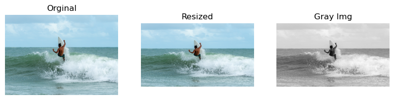

## Cropping Images
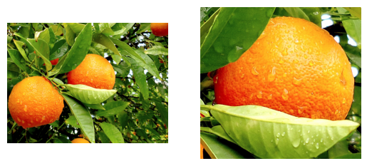

## Flipping Images
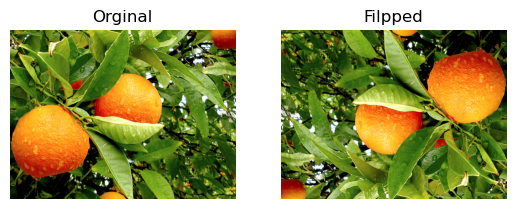

## Filtering Images
- Gaussian Blur, Normal Blur, and Bilateral Blur
  
  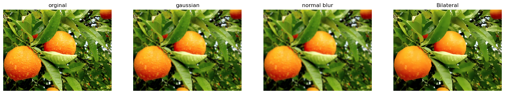

- Median Blur

  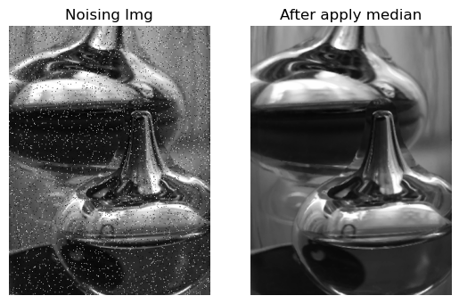

## Thresholding
- Binary & Binary Inverse Thresholding
  
  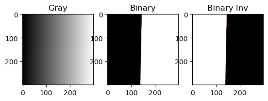

- Trunc Thresholding
  
  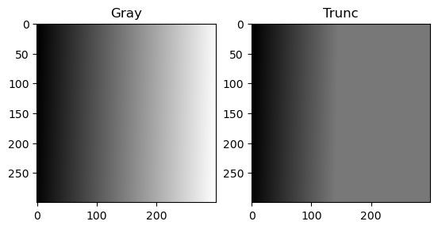

- Tozero & Tozero Inverse Thresholding
  
  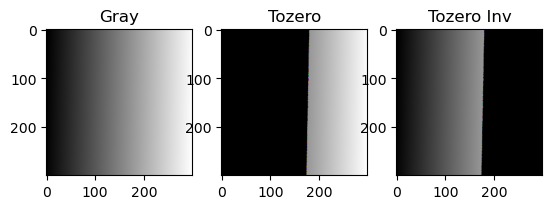

- ADAPTIVE_THRESH_MEAN_C
  
  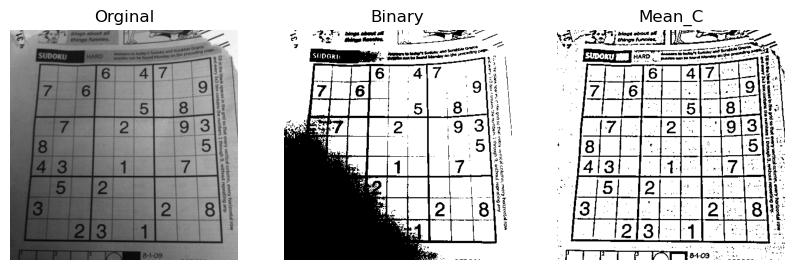

- ADAPTIVE_THRESH_GAUSSIAN_C
  
  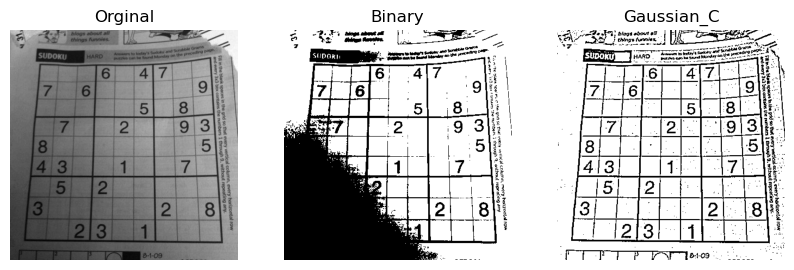

- Otsu Thresholding
  
  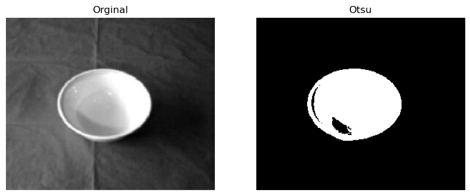

## Histogram
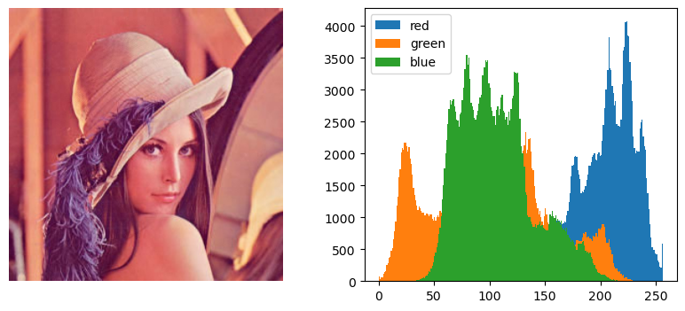

## Histogram Equalization
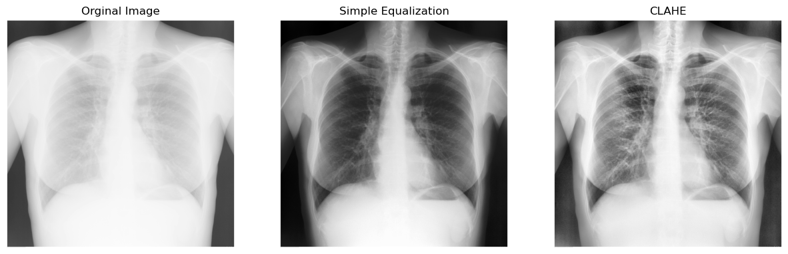

## Morphological Transformations
- Erosion
  
  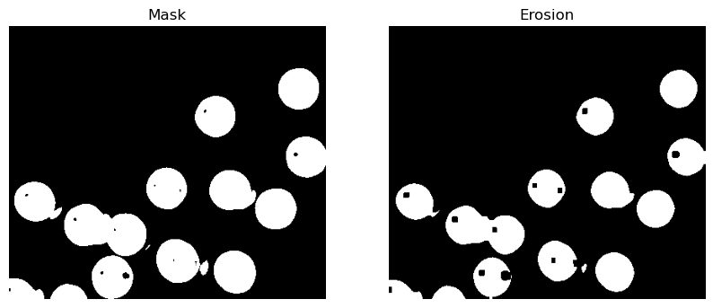

- Dilation
  
  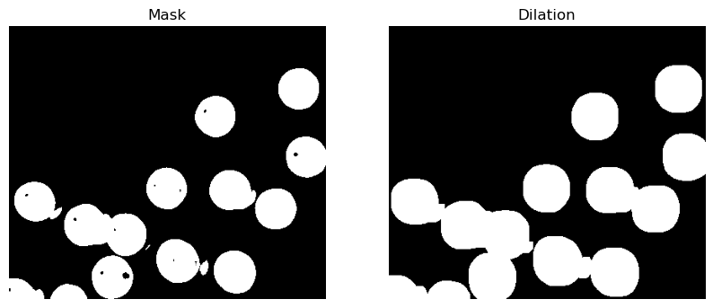

## Image Gradients & Edge Detection
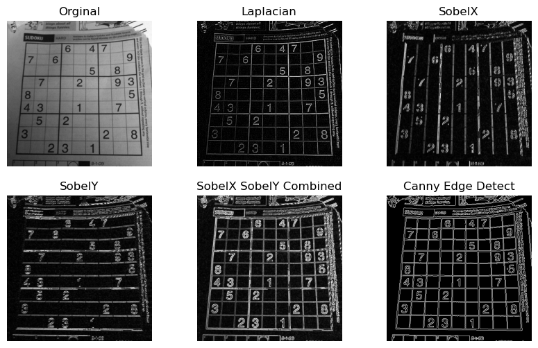

